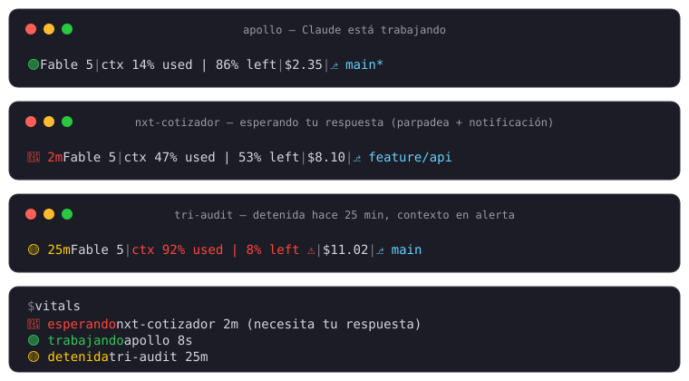

# claude-vitals

Signos vitales de tus sesiones de [Claude Code](https://claude.com/claude-code), pensado para cuando trabajas en **muchos proyectos a la vez**: cada terminal te dice de un vistazo si Claude está trabajando, detenido, o esperándote — y si te espera, te busca él a ti.

Con treinta ventanas abiertas repartidas en varios Spaces, un ícono en la statusline mide un par de píxeles en Mission Control. Por eso la señal de "te estoy esperando" no vive solo ahí: **la ventana entera se pinta**, y `vitals go` te lleva a ella.



## Qué hace

**En la statusline de cada terminal:**

- **Semáforo de actividad**: 🟢 parpadeando = trabajando · 🔴 parpadeando = **esperando tu respuesta** (permiso o pregunta) · 🟡 = detenida, con el tiempo que lleva así (`🟡 25m`)
- **Modelo** en uso
- **Contexto** usado/restante — se pinta **rojo con ⚠** al superar el umbral (default 80%)
- **Costo** acumulado de la sesión en USD
- **Rama git** del workspace, con `*` si hay cambios sin commitear
- **📡 Remote Control**: aparece al final de la línea mientras la sesión está conectada a claude.ai (vía `CLAUDE_CODE_BRIDGE_SESSION_ID`, requiere Claude Code ≥ 2.1.199)
- **3IA ✓/✗**: salud de las cuentas de IA de tri-audit, sin costo por refresco: la statusline solo muestra el cache del último `vitals ai --live`, y cuando tiene más de `VITALS_AI_TTL_HOURS` (default 5h) dispara **un** re-chequeo en background con candado compartido entre todas las sesiones. Si una IA falló, sale en rojo con su nombre: `3IA ✗ codex`
- **⚖ tri-audit**: si el proyecto tiene una auditoría tri-audit activa — una metodología de auditoría multi-IA por fases que registra su avance en `.audit/estado.md`, muestra la fase en curso: `⚖ F4` (fase 4 pendiente), `⚖ F2↺` (ciclo de REWORK), `⚖ F7 gate` en amarillo (pausada esperando tu decisión pre-deploy), `⚖ STOP F4` en rojo (stop condition), `⚖ ✓` (iteración completa). También aparece en el CLI `vitals`. Sin `.audit/` no muestra nada

**La ventana entera cambia de color según el estado:**

- **Fondo de la ventana completa** — la señal con más superficie visible, y la única que sigue leyéndose cuando miras 30 ventanas desde Mission Control. Los tres colores mantienen ~11:1 de contraste con el texto, así que puedes trabajar sobre ellos sin molestia:

  | Estado | Color | |
  |---|---|---|
  | esperándote | `#4a1015` | rojo |
  | trabajando | `#0f2a18` | verde |
  | detenida | `#2e2408` | ámbar |

  Cada uno se puede cambiar o desactivar por separado (`VITALS_BG_WORKING=-` deja ese estado sin pintar).
- **Badge de iTerm2** con el nombre del proyecto en letras grandes, **solo cuando te espera** — es el único estado en el que necesitas saber *cuál* proyecto es sin entrar a la ventana
- **Rebote del ícono en el Dock**, visible desde cualquier Space sin abrir Mission Control. Solo surte efecto si iTerm2 no es la app activa, que es cuando de verdad hace falta

Todo se revierte solo al responder. Si algo queda pintado porque una sesión murió de golpe, se limpia al abrir Claude en esa ventana, y `vitals reset-colors` es la escotilla manual.

**Fuera de la statusline:**

- **Color del tab de iTerm2** según el estado (verde/amarillo/rojo)
- **Notificación de macOS** si una sesión lleva más de N segundos esperando tu respuesta (default 10s, anti-ruido)
- **CLI `vitals`**: resumen de todas las sesiones de la máquina:

```
$ vitals
 1. 🔴 esperando   nxt-cotizador   2m     (necesita tu respuesta)
 2. 🟢 trabajando  apollo          8s     ⚖ F2↺
 3. 🟡 detenida    tri-audit       25m

── 3 sesiones: 1 trabajando · 1 esperándote · 1 detenidas
   vitals go   salta a la que lleva más tiempo esperándote
```

Solo lista sesiones vivas: cada estado guarda el PID de su proceso `claude`, así que una terminal que cerraste sin más deja de aparecer en vez de seguir gritando "esperando" durante días.

- **CLI `vitals go`**: trae al frente la ventana de la sesión, cambiando de Space si hace falta. Sin argumentos va a la que lleva más tiempo esperándote; también acepta el número de la lista o parte del nombre del proyecto (`vitals go apollo`). Funciona porque el hook guarda el UUID de sesión de iTerm2 junto al estado

```
$ vitals go
→ nxt-cotizador (esperándote hace 2m)
```

Requiere permiso de Automatización de la terminal sobre iTerm2; macOS lo pide la primera vez.

- **CLI `vitals demo [hex] [segundos]`**: aplica las señales de "te espera" en la terminal donde lo corres y las revierte solo. Para calibrar el color contra Mission Control, que es donde importa que destaque: `vitals demo 6b1119 20`

- **CLI `vitals ai`**: salud de las cuentas de IA que usa tri-audit (Claude Code, OpenAI Codex CLI, Google Gemini API). Sin argumentos verifica config y credenciales al instante; con `--live` hace una llamada real a las tres **en paralelo** y reporta latencia:

```
$ vitals ai --live
Probando las 3 IAs en paralelo (timeout 60s)...

Claude   ✅ respondió en 7s
Codex    ✅ respondió en 6s
Gemini   ✅ respondió en 3s (gemini-pro-latest)
```

## Ítem de barra de menú (opcional)

Un contador siempre visible arriba, sin abrir Mission Control: `🔴 3` cuando hay sesiones esperándote. Al desplegarlo lista todas, y **al hacer clic en una salta a su ventana**.

Requiere [SwiftBar](https://github.com/swiftbar/SwiftBar):

```bash
brew install --cask swiftbar
mkdir -p ~/.swiftbar
ln -sf "$(pwd)/menubar/vitals.5s.sh" ~/.swiftbar/vitals.5s.sh
defaults write com.ameba.SwiftBar PluginDirectory -string "$HOME/.swiftbar"
open -a SwiftBar
```

El plugin no habla con el estado directamente: consume `vitals --porcelain`, una línea TSV por sesión (`estado`, `proyecto`, `segundos`, `uuid`, `badge`), así que cualquier otra barra o script puede usar la misma fuente.

Si usas Bartender o similar, revisa que no esté escondiendo el ícono nuevo — suele ocultar por defecto los que aparecen por primera vez.

## Cómo funciona

Tres piezas:

1. **`vitals.sh`** (statusline): Claude Code invoca el comando configurado en `statusLine` de `~/.claude/settings.json` en cada refresco, pasándole un JSON por stdin (modelo, ventana de contexto, costo, session_id, workspace...). Con `refreshInterval: 1` se re-ejecuta cada segundo, lo que permite el parpadeo y el conteo de tiempo detenido. La consulta a git se cachea unos segundos para no castigar repos grandes.

2. **`vitals-hook.sh`** (hooks): invocado en los eventos del ciclo de vida de cada sesión. Escribe el estado en `~/.claude/vitals-state/<session_id>` (línea 1: estado · 2: directorio del proyecto · 3: UUID de sesión de iTerm2, que es lo que permite `vitals go` · 4: PID de `claude`, que es lo que distingue una sesión viva de una terminal cerrada), pinta las señales visuales y dispara la notificación de macOS:
   - `UserPromptSubmit` / `PostToolUse` → `working` (verde)
   - `Stop` / `SessionStart` → `idle` (amarillo)
   - `Notification` → `waiting` (rojo) + notificación si sigue esperando tras `VITALS_NOTIFY_DELAY`
   - `SessionEnd` → borra el estado y restaura tab, fondo y badge

   En cada invocación recoge basura: se van los estados cuyo proceso `claude` ya no existe y los caches sin sesión.

3. **`vitals`** (CLI): lee `~/.claude/vitals-state/`, descarta las sesiones muertas y lista el resto, las que te esperan primero. `vitals go` usa AppleScript para traer al frente la ventana de iTerm2 con ese UUID.

## Instalación

```bash
git clone https://github.com/mrtacojr/claude-vitals.git
cd claude-vitals
ln -sf "$(pwd)/vitals.sh" ~/.claude/statusline-command.sh
ln -sf "$(pwd)/vitals-hook.sh" ~/.claude/vitals-hook.sh
ln -sf "$(pwd)/vitals" /usr/local/bin/vitals   # o cualquier dir de tu PATH
```

Y en `~/.claude/settings.json` configura la statusline y los hooks (si ya tienes hooks propios, agrega las entradas de vitals junto a las tuyas, no las reemplaces):

```json
{
  "statusLine": {
    "type": "command",
    "command": "~/.claude/statusline-command.sh",
    "refreshInterval": 1
  },
  "hooks": {
    "UserPromptSubmit": [{ "hooks": [{ "type": "command", "command": "$HOME/.claude/vitals-hook.sh", "async": true, "timeout": 5 }] }],
    "PostToolUse":      [{ "hooks": [{ "type": "command", "command": "$HOME/.claude/vitals-hook.sh", "async": true, "timeout": 5 }] }],
    "Stop":             [{ "hooks": [{ "type": "command", "command": "$HOME/.claude/vitals-hook.sh", "async": true, "timeout": 5 }] }],
    "Notification":     [{ "hooks": [{ "type": "command", "command": "$HOME/.claude/vitals-hook.sh", "async": true, "timeout": 5 }] }],
    "SessionStart":     [{ "hooks": [{ "type": "command", "command": "$HOME/.claude/vitals-hook.sh", "async": true, "timeout": 5 }] }],
    "SessionEnd":       [{ "hooks": [{ "type": "command", "command": "$HOME/.claude/vitals-hook.sh", "async": true, "timeout": 5 }] }]
  }
}
```

Las sesiones abiertas toman los hooks al reiniciarlas. Nota: la primera notificación puede requerir que autorices "Script Editor"/osascript en Ajustes → Notificaciones.

## Configuración

Todo es opcional y viene encendido por defecto. Para cambiar algo:

```bash
cp vitals.conf.example ~/.claude/vitals.conf
```

y descomenta lo que quieras: apagar módulos (`VITALS_COST=0`), cambiar el umbral de alerta de contexto (`VITALS_CTX_ALERT=90`), el retraso de la notificación (`VITALS_NOTIFY_DELAY=30`), etc. Ver [`vitals.conf.example`](vitals.conf.example).

## Requisitos

- macOS: el color de tab, el badge, el rebote del Dock y `vitals go` son de iTerm2; las notificaciones usan `osascript`
- El **fondo de ventana** funciona además en kitty, WezTerm, Ghostty y xterm: en iTerm2 se usa su secuencia propia y en el resto OSC 11/111, que es el estándar
- El resto de la statusline y del CLI necesita `bash`, `jq` y el `stat` de BSD (macOS)

## Ideas / pendientes

- [x] Semáforo de actividad por sesión (verde/amarillo/rojo + color de tab en iTerm2)
- [x] Costo de la sesión
- [x] Rama de git del workspace con indicador de cambios
- [x] Alerta de contexto alto
- [x] Tiempo detenido
- [x] Notificación de macOS cuando Claude espera tu respuesta
- [x] CLI `vitals` con el resumen de todas las sesiones
- [x] Configuración por módulos
- [x] Indicador 📡 de Remote Control activo
- [x] Fase de auditoría tri-audit del proyecto (⚖)
- [x] `vitals ai [--live]`: salud de las 3 cuentas de IA (Claude/Codex/Gemini)
- [x] Badge 3IA en la statusline con cache y refresco en background cada N horas
- [x] Fondo de la ventana completa según el estado (rojo/verde/ámbar)
- [x] Badge de iTerm2 con estado y proyecto, y rebote del Dock
- [x] `vitals go`: saltar a la ventana que te espera
- [x] Descartar sesiones muertas por PID en vez de por antigüedad
- [x] Ítem de barra de menú con contador y salto de un clic (SwiftBar)
- [ ] `vitals --watch` (refresco en vivo del resumen)
- [ ] Historial de costo por proyecto

## Contribuir

Issues y PRs son bienvenidos. La única regla: la salida debe caber en una línea de terminal.

## Licencia

[MIT](LICENSE)
